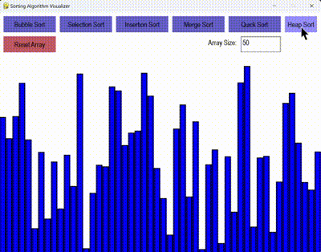

# Sorting Algorithms Visualization

Welcome to the **Sorting Algorithms Visualization** project! This project uses Pygame to visualize various sorting algorithms, making it easier to understand how they work.

  <!-- Replace with the path to your GIF -->

## Features

- Visual representation of sorting algorithms:
  - Bubble Sort
  - Selection Sort
  - Insertion Sort
  - Merge Sort
  - Quick Sort
  - Heap Sort
- Interactive controls for selecting the sorting algorithm
- Input field to define the number of data elements to sort
- Reset functionality to generate a new random array

## Getting Started

### Prerequisites

- Python 3.x
- Pygame library

### Installation

1. Clone the repository:

   ```bash
   git clone https://github.com/yourusername/sorting-visualization.git
   cd sorting-visualization
   ```

2. Install the required packages:

   ```bash
   pip install pygame
   ```

### Usage

1. Run the program:

   ```bash
   python visualizer.py
   ```

2. Use the buttons to select the sorting algorithm you want to visualize.
3. Adjust the number of data elements using the input field and click "Reset Array" to generate a new set of data.
4. Watch the sorting algorithm in action!

## Contributing

Contributions are welcome! If you have suggestions for improvements or additional features, please open an issue or submit a pull request.

## License

This project is licensed under the MIT License - see the [LICENSE](LICENSE) file for details.

## Acknowledgments

- Inspired by the desire to visualize sorting algorithms for better understanding and learning.
